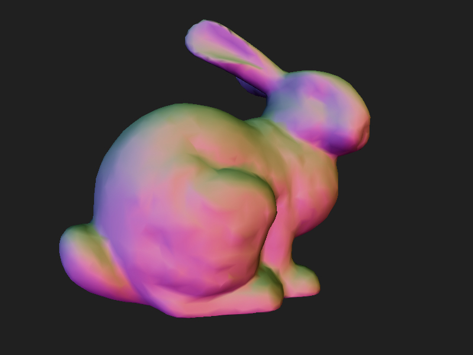
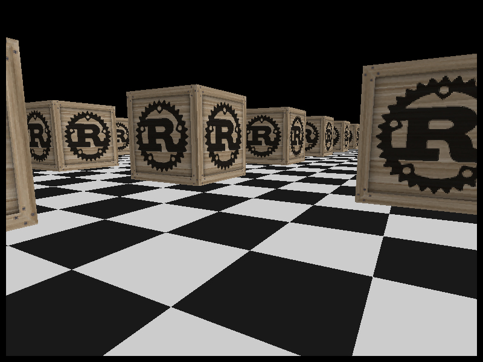
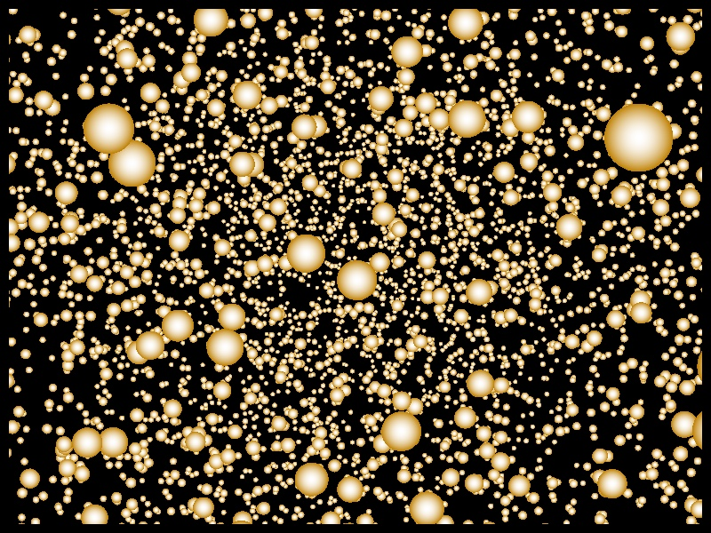

```
                                                    ______
                        ___                       /´   ___/\
      __ ______ _____ /   /\_ _ ______ _____ ____/   /_/___/\ __ _____ ______
   ==/  ´ ____/ __   \   ____/ ´ ____/  __  ` __    ___,  /==/  ´  ___/ __   \
  ==/   /´=/   ______/  /==/   /´=/   /==/   /=/   /=/   /==/   /´=/   ______/\
 ==/   /==/   /____/   /__/   /==/   /__/   /=/   /=/   /__/   /==/   /______\/
==/___/ ==\_______/\______/__/ ==\________,´_/   /==\______/__/ ==\________/\
==\___\/ ==\______\/\_____\__\/ ==\______/_____,´ /==\_____\___\/==\_______\/
                                         \_____\,´
```

# Introduction

*Note: This document is best viewed on an 80-column VGA terminal.*

Retrofire is a software 3D rendering library focusing on performance,
correctness, and pedagogical value.

The Retrofire project began as a shamelessly nostalgic effort to explore
the state of graphics programming as it was in the mid-to-late 90s in
the gamedev and demoscene circles of the era, before the proliferation
of hardware 3D acceleration. More recently, as a result of the author's
frustration when debugging the earlier versions, it has grown into an
experiment on using the Rust type system to prevent several sorts of bugs
common in graphics programming that might normally manifest as graphical
glitches or runtime panics at best.

# Philosophy

Keeping with the do-it-yourself mentality of the demoscene and the 90s
state of software dev in general, retrofire aims to have the bare minimum
number of external dependencies. The current number of required dependencies
is zero.

On the other hand, retrofire also aims to utilize the bare minimum amount
of unsafe code, and only if shown to have a measurable effect on performance
by a profiler. The current number of unsafe lines of code is zero.

A third goal of this project, again in the demoscene spirit, is to function
on puny hardware with few or no operating system services required. To that
end, all core functionality only requires `alloc`, and components requiring
`std` are behind optional features or split into separate crates. Support
for custom allocators is planned in order to make `alloc` optional as well.

# Features

## Done

* Software 3D rendering pipeline with a subpixel-precise rasterizer
* Trait-based interpolation of arbitrary vertex attributes
* User-definable vertex and fragment shaders, written in Rust
* Type-tagged affine, vector, and color spaces and bases
* Type-tagged affine and linear transforms and projections
* Perspective-correct texture mapping
* Triangle mesh data structure and a library of shapes
* Simple text rendering with bitmap fonts
* Fully customizable rasterization stage
* Collecting rendering performance data
* Reading and writing pnm image files
* Reading and writing Wavefront .obj files
* Cubic Bezier curves and splines
* Simple random number generation and distributions
* Minifb, SDL2, and Wasm frontends
* Forever emoji-free README and docs
* Forever LLM-free code

## In progress

* Different camera types
* Builtin light source support
* Spherical etc UV mapping
* Procedural noise generation
* Terminal frontend with ncurses
* Cube mapping and skyboxes

## Planned

* Material support
* Basic scene graph
* Hierarchical transforms
* Mipmapping and mipmap generation
* More procedural generation
* Basic animation and sequencing
* Particle simulations
* Support for more file types

# Organization

Retrofire is split into several packages:

* retrofire: a metapackage that just re-exports core, geom, and front
* retrofire-core:  math, renderer, utilities; no-std compatible
* retrofire-geom:  geometric shapes, mesh builders, model loading
* retrofire-front: frontends for writing simple graphical applications
* retrofire-demos: binaries showcasing retrofire features.

# Dependencies

The minimum supported Rust version is the current stable, at least for now.

The `retrofire-core` package only requires `alloc` and has no non-optional
external dependencies. However, because `no_std` lacks most floating-point
functions, the package is not fully functional unless either the `std`,
`libm`, or `mm` feature is enabled. Activating `std` additionally enables
APIs that do I/O.

The `retrofire-front` package depends on either `sdl2`, `minifb`, or
`wasm-bindgen` and `web-sys`, depending on enabled features.

The `retrofire-geom` package has no external dependencies. It only requires
`alloc`; activating the optional feature `std` enables APIs that do I/O.

The `retrofire-demos` package depends on `retrofire`.

# Screenshots

The classic Stanford bunny.


A first-person mouse-and-keyboard scene with many "Rust crates" strewn on a
checkered floor.


Ten thousand spherical particles positioned randomly in a sphere.


# License

Copyright 2020-2025 Johannes Dahlström.

Retrofire is licensed under either of:

* Apache License, Version 2.0
  (LICENSE-APACHE or http://www.apache.org/licenses/LICENSE-2.0)

* MIT license (LICENSE-MIT or http://opensource.org/licenses/MIT)

at your option. Unless you explicitly state otherwise, any contribution
intentionally submitted for inclusion in the work by you, as defined in
the Apache-2.0 license, shall be dual licensed as above, without any
additional terms or conditions.
