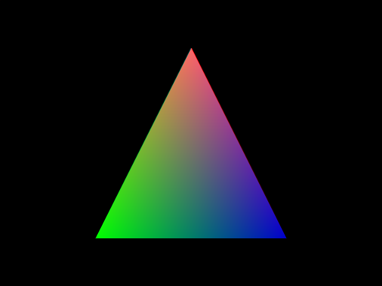

```
                                                    ______
                        ___                       /´   ___/\
      __ ______ _____ /   /\_ _ ______ _____ ____/   /_/___/\ __ _____ ______
   ==/  ´ ____/ __   \   ____/ ´ ____/  __  ` __    ___,  /==/  ´  ___/ __   \
  ==/   /´=/   ______/  /==/   /´=/   /==/   /=/   /=/   /==/   /´=/   ______/\
 ==/   /==/   /____/   /__/   /==/   /__/   /=/   /=/   /__/   /==/   /______\/
==/___/ ==\_______/\______/__/ ==\________,´_/   /==\______/__/ ==\________/\
==\___\/ ==\______\/\_____\__\/ ==\______/_____,´ /==\_____\___\/==\_______\/
                                         \_____\,´
```

## Retrofire no_std demo

A small demo program aimed at minimizing the executable size. It uses
[`retrofire`][rf] to transform, clip, project, and rasterize a colorful
triangle and prints the result in PPM format to stdout. Pipe or redirect
the output if you don't want to fill your terminal with binary nonsense:

```
  $ cargo run -r > output.ppm
```

Unless `std` is compiled without panic support, the build is somewhat finicky
and requires the use of the release profile specified in Cargo.toml to make
sure that LLVM rips out everything referring to `rust_eh_personality`, lest
the linker complain about an undefined symbol.

[rf]: https://github.com/jdahlstrom/retrofire

### Dependencies

The demo is `#[no_std]` and the only thing it needs from `alloc` is `Vec`.
It provides a global allocator that is a minimal wrapper of libc `malloc`
and `free`, and uses `libc` `puts` and `putchar` to output the image. The
program has neither direct nor transitive dependencies beyond `alloc`,
`libc`, and`retrofire-core`.

### Executable size

On macOS `x86_64-apple-darwin`, the size of the compiled executable is around
20 kB when built in release mode. Of that, the `text` section takes up 10 kB
or so. On Windows 10 `x86_64-pc-windows-msvc` the executable size is roughly
16 kB. A 4k intro this is not, but not a bad result given that apart from
ripping out`std`, no specific manual size optimization has been done.

### The output



### Acknowledgements

Big thanks to user @jonthagen for their awesome [`min-sized-rust`][msr]
guide to minimizing the size of Rust binaries.

[msr]: https://github.com/johnthagen/min-sized-rust

### License

Licensed under the MIT license, found in [LICENSE-MIT](LICENSE-MIT).
